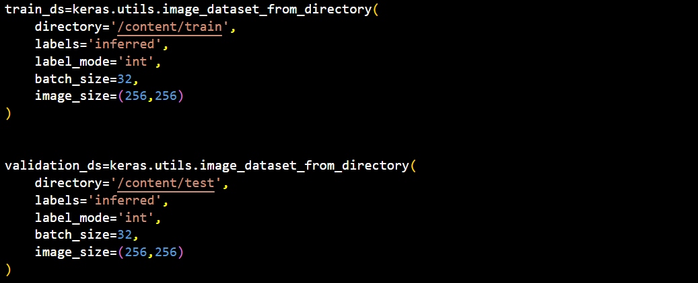
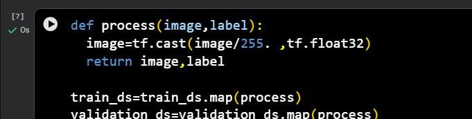
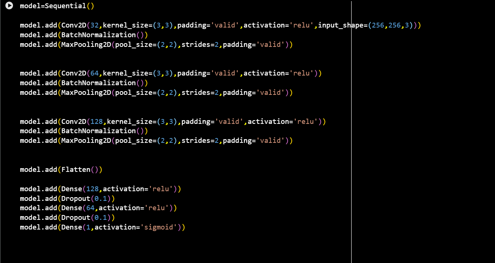
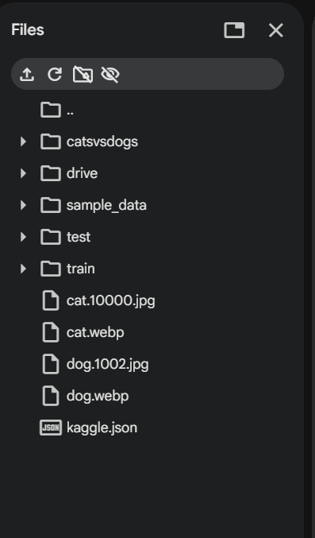
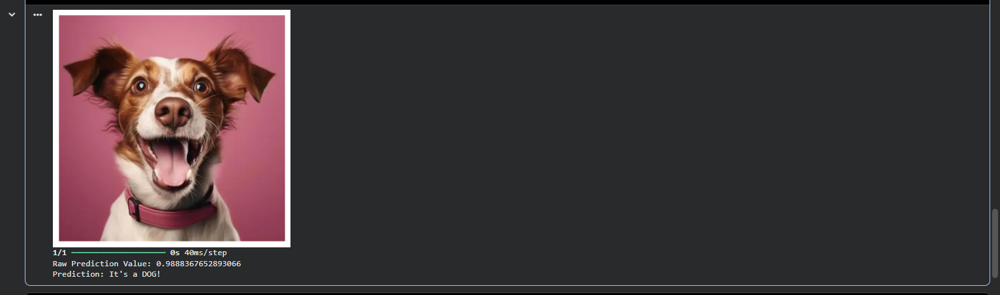
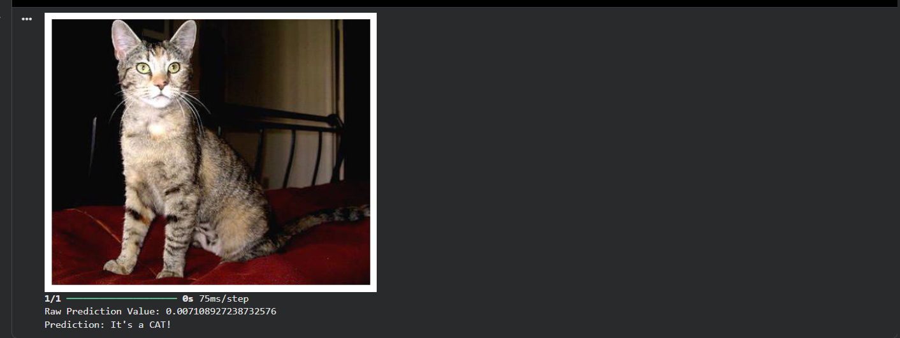
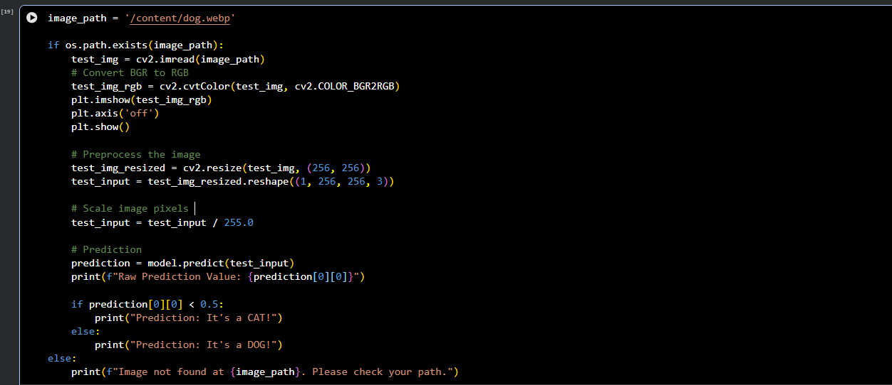
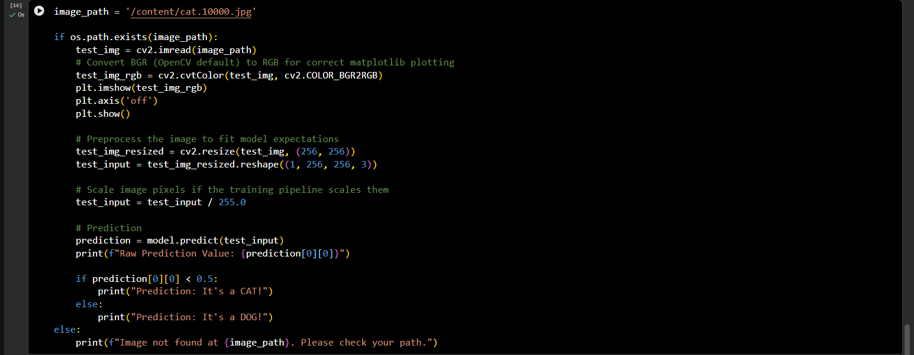

# 🐶🐱 Cats vs Dogs Image Classification using CNN

A Convolutional Neural Network (CNN) built using **TensorFlow/Keras** to classify images as **Cats** or **Dogs**. The model is trained on the Kaggle Dogs vs Cats dataset and can also predict custom images.

---

# 📌 Project Overview

This project demonstrates the complete deep learning workflow:

- Loading image dataset
- Image preprocessing & normalization
- Building a CNN model
- Model training and validation
- Accuracy visualization
- Prediction on custom images

---

# 🚀 Features

- Binary Image Classification
- Custom CNN Architecture
- Batch Normalization
- Dropout Regularization
- Image Normalization
- Custom Image Prediction
- Accuracy Visualization

---

# 🛠 Tech Stack

- Python
- TensorFlow / Keras
- NumPy
- OpenCV
- Matplotlib
- Kaggle API
- Google Colab

---

# 📂 Dataset

**Dogs vs Cats Dataset**

https://www.kaggle.com/datasets/salader/dogsvscats

| Dataset | Images |
|---------|--------:|
| Training | 20,000 |
| Validation | 5,000 |

Classes

- 🐱 Cats
- 🐶 Dogs

---

# 📸 Project Screenshots

## Dataset Loading



---

## Image Preprocessing



---

## CNN Model Architecture



---

## Project Directory



---

## Dog Prediction



---

## Cat Prediction



---

## Training Accuracy



---

## Validation & Results



---

# 🧠 CNN Architecture

```text
Input (256×256×3)

↓

Conv2D (32) + ReLU

↓

BatchNormalization

↓

MaxPooling

↓

Conv2D (64) + ReLU

↓

BatchNormalization

↓

MaxPooling

↓

Conv2D (128) + ReLU

↓

BatchNormalization

↓

MaxPooling

↓

Flatten

↓

Dense (128)

↓

Dropout (0.1)

↓

Dense (64)

↓

Dropout (0.1)

↓

Dense (1)

↓

Sigmoid
```

---

# ⚙ Training Configuration

| Parameter | Value |
|-----------|-------|
| Optimizer | Adam |
| Loss Function | Binary Crossentropy |
| Epochs | 10 |
| Batch Size | 32 |
| Image Size | 256 × 256 |

---

# 📈 Model Performance

- **Training Accuracy:** ~97%
- **Validation Accuracy:** ~83.5%

The model performs well on the validation dataset and correctly classifies most cat and dog images. Some unseen real-world images may still be misclassified because the model is trained using a custom CNN.

---

# 🔍 Prediction

The prediction pipeline consists of:

- Load Image
- Resize to 256×256
- Normalize Pixel Values
- Predict using CNN
- Display Result

### Example

```text
Raw Prediction Value : 0.9888

Prediction : DOG
```

```text
Raw Prediction Value : 0.0071

Prediction : CAT
```

---

# 📁 Project Structure

```text
Cats-vs-Dogs-CNN
│
├── Screenshots
│   ├── data1.png
│   ├── data2.png
│   ├── data3.png
│   ├── data4.png
│   ├── data5.png
│   ├── data6.png
│   ├── data7.png
│   └── data8.png
│
├── model.ipynb
├── README.md
└── requirements.txt
```

---

# ▶️ Getting Started

### Clone Repository

```bash
git clone https://github.com/your-username/Cats-vs-Dogs-CNN.git
```

### Install Dependencies

```bash
pip install tensorflow numpy matplotlib opencv-python kaggle
```

### Download Dataset

```bash
kaggle datasets download -d salader/dogsvscats
```

### Train the Model

Run all notebook cells sequentially.

### Predict on a Custom Image

Update the image path and run the prediction cell.

---

# 📚 Key Learnings

- CNN Fundamentals
- Image Preprocessing
- Batch Normalization
- Dropout
- Binary Classification
- Model Evaluation
- Custom Image Prediction

---

# 🚀 Future Improvements

- Data Augmentation
- Transfer Learning (MobileNetV2 / EfficientNet)
- Streamlit or Flask Deployment
- Hyperparameter Tuning

---

# 👨‍💻 Author

**Vinay Choudhary**

B.Tech – Computer Science & Information Technology

Machine Learning • Deep Learning • Generative AI

---

### ⭐ If you found this project useful or learned something from it, feel free to leave a star on the repository. It helps others discover the project and motivates future improvements.
